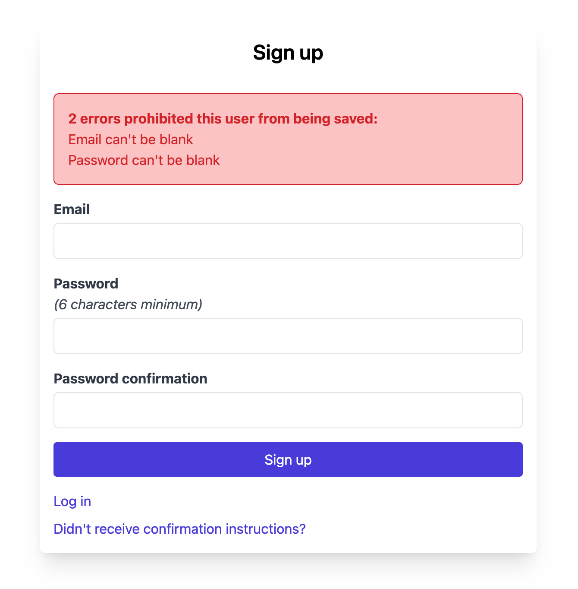

# DeviseTemplate

Generate Devise views styled with either TailwindCSS 3 or Bootstrap 5 easily.



## Installation

1. Add the gem to your Rails application's Gemfile:

```ruby:Gemfile
gem 'devise_template', group: :development
```

2. Then execute

```
bundle install
```

## Usage

Make sure TailwindCSS 3 / Bootstrap 5 is installed.

Once installed, you can generate Devise views styled with TailwindCSS or Bootstrap using the following commands:

### For TailwindCSS 3

```
rails generate devise_template:tailwind
```

This will copy TailwindCSS-styled Devise views to your app/views/devise directory.

### For Bootstrap 5

```
rails generate devise_template:bootstrap
```

This will copy Bootstrap-styled Devise views to your app/views/devise directory.

## Contributing

1. Fork it ( https://github.com/YutoYasunaga/devise_template/fork)
2. Create your feature branch (git checkout -b my-new-feature)
3. Commit your changes (git commit -am 'Add some feature')
4. Push to the branch (git push origin my-new-feature)
5. Create a new Pull Request

## License

The gem is available as open source under the terms of the [MIT License](https://opensource.org/licenses/MIT).
